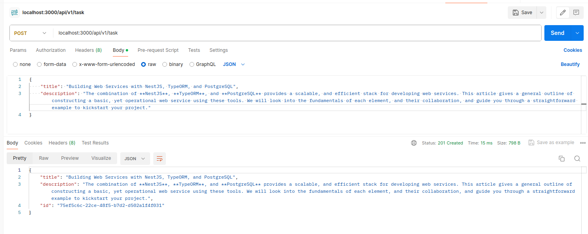
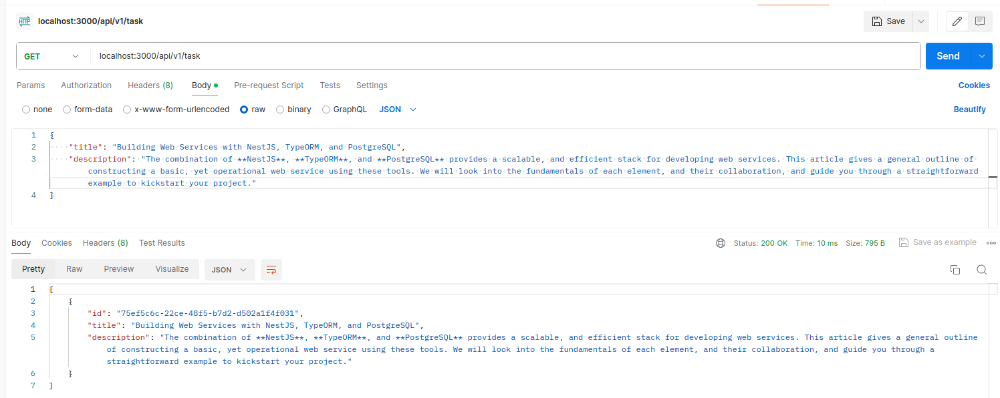
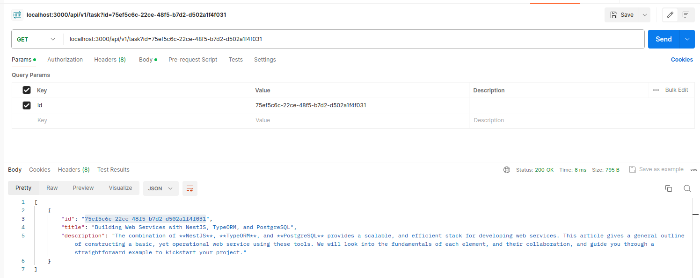
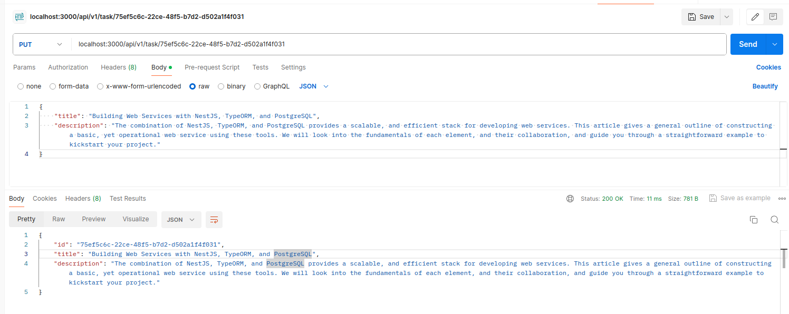
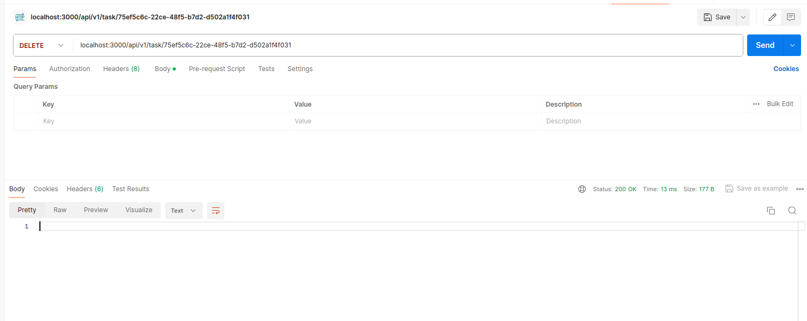

# Building Web Services with NestJS, TypeORM, and PostgreSQL

The combination of **NestJS**, **TypeORM**, and **PostgreSQL** provides a scalable, and efficient stack for developing web services. This article gives a general outline of constructing a basic, yet operational web service using these tools. We will look into the fundamentals of each element, and their collaboration, and guide you through a straightforward example to kickstart your project.

## Introduction to the Stack

### NestJS

NestJS is a framework for building efficient, scalable [Node.js](https://nodejs.org/en) server-side applications. It uses progressive JavaScript, is built with and fully supports [TypeScript](https://www.typescriptlang.org/) (yet still enables developers to code in pure JavaScript) and combines elements of OOP (Object Oriented Programming), FP (Functional Programming), and FRP (Functional Reactive Programming).

### TypeORM

TypeORM is an [ORM](https://en.wikipedia.org/wiki/Object%E2%80%93relational_mapping) (Object-Relational Mapping) library that can run in Node.js and can be used with TypeScript and JavaScript (ES5+). It supports the Active Record and Data Mapper patterns, unlike all other JavaScript ORMs currently in existence, which means you can write high-quality, loosely coupled, scalable, maintainable applications most efficiently.

### PostgreSQL

PostgreSQL is a powerful, open-source object-relational database system that uses and extends the SQL language combined with many features that safely store and scale the most complicated data workloads.

## Requirements

- Node.js (version >= 16)
- npm (or Yarn)
- PostgreSQL
- (OPTIONAL) Docker and Postman

## Setting Up the Project

> Create a new NestJS project

```
npm i -g @nestjs/cli nest new project-name
```

Navigate into your project directory before proceeding.

> Install TypeORM and PostgreSQL

```
npm install --save @nestjs/config @nestjs/typeorm typeorm pg
```

- _@nestjs/config_: NestJS module for configuration
- _@nestjs/typeorm_: NestJS module for TypeORM
- _typeorm_: ORM for NodeJS
- _pg_: Postgres driver for NodeJS

> Database Connection

- create an `.env` in the root of your project

```
POSTGRES_HOST=localhost
POSTGRES_PORT=5432
POSTGRES_USER=postgres
POSTGRES_PASSWORD=jimmy@246
POSTGRES_DB=crud-rest-api
```

- create an typeormconfig.ts file to configure TypeORM with PostgreSQL

```
import { registerAs } from '@nestjs/config';
import { config as dotenvConfig } from 'dotenv';
import { DataSource, DataSourceOptions } from 'typeorm';

dotenvConfig({ path: '.env' });

const config = {
  type: 'postgres',
  host: `${process.env.POSTGRES_HOST}`,
  port: `${process.env.POSTGRES_PORT}`,
  username: `${process.env.POSTGRES_USER}`,
  password: `${process.env.POSTGRES_PASSWORD}`,
  database: `${process.env.POSTGRES_DB}`,
  entities: ['dist/**/*.entity{.ts,.js}'],
  migrations: ['dist/migrations/*{.ts,.js}'],
  autoLoadEntities: true,
  synchronize: true,
};

export default registerAs('typeorm', () => config);
export const connectionSource = new DataSource(config as DataSourceOptions);
```

- Add `app.setGlobalPrefix('api/v1'); in main.ts` (OPTIONAL)

  - It adds the prefix api/v1 to every route registered in the application.
  - This means all API endpoints will be accessible under the api/v1 path.

- Add `app.enableCors(); in main.ts` (OPTIONAL)

  - Allows requests from frontend applications on different domains to access the API endpoints.
  - Improves security by controlling which origins (domains or subdomains) can make requests to the API.

> Integrate Config into Nestjs

- To add the typeorm.ts into the main root module, which is mostly named as app.module.ts

```import { Module } from '@nestjs/common';
import { AppController } from './app.controller';
import { AppService } from './app.service';
import { ConfigModule, ConfigService } from '@nestjs/config';
import { TypeOrmModule } from '@nestjs/typeorm';
import typeorm from './config/typeorm';

@Module({
  imports: [
    ConfigModule.forRoot({
      isGlobal: true,
      load: [typeorm],
    }),
    TypeOrmModule.forRootAsync({
      inject: [ConfigService],
      useFactory: async (configService: ConfigService) =>
        configService.get('typeorm'),
    }),
  ],
  controllers: [AppController],
  providers: [AppService],
})
export class AppModule {}
```

In the AppModule, NestJS uses ConfigModule to globally load application configurations, including TypeORM options defined in config/typeorm.ts. The TypeOrmModule.forRootAsync method fetches TypeORM configuration asynchronously via ConfigService, enabling seamless integration with the application's configuration.

Let’s create a simple CRUD (Create, Read, Update, Delete) application that manages a list of tasks.

First, define a Task entity that TypeORM will use to create the tasks table in your PostgreSQL database.

## Create a Task Entity

Inside the src folder, create a new folder named task. Inside task, create a another folder entities and inside entities create a file named task.entity.ts

```
import { Entity, PrimaryGeneratedColumn, Column } from 'typeorm';

@Entity()
export class Task {
  @PrimaryGeneratedColumn('uuid')
  id?: string;

  @Column({ nullable: true })
  title: string;

  @Column()
  description: string;
}
```

## Create a Task Module

NestJS is modular, so you’ll organize your code into modules. For the task, you’ll create a task module, service, and controller.

> Generate Task Module, Service, and Controller

```
nest generate module task
nest generate service task
nest generate controller task
```

## Implementing CRUD Operations

> Update the Task Service

In the tasks.service.ts file, begin by importing essential dependencies: the InjectRepository decorator from @nestjs/typeorm and the Repository from typeorm. Additionally, import the Task entity that was recently created. Once imported, proceed to implement the CRUD (Create, Read, Update, Delete) operations:

```
import { Injectable } from '@nestjs/common';
import { InjectRepository } from '@nestjs/typeorm';
import { Repository } from 'typeorm';
import { Task } from './entities/task.entity';

@Injectable()
export class TasksService {
  constructor(
    @InjectRepository(Task)
    private taskRepository: Repository<Task>,
  ) {}

  async findAll(): Promise<Task[]> {
    return await this.taskRepository.find();
  }

  async findOne(id: string): Promise<Task> {
    return await this.taskRepository.findOne({ where: { id } });
  }

  async create(task: Task): Promise<Task> {
    return await this.taskRepository.save(task);
  }

  async update(id: string, task: Task): Promise<Task> {
    await this.taskRepository.update(id, task);
    return await this.taskRepository.findOne({ where: { id } });
  }

  async remove(id: number): Promise<void> {
    await this.taskRepository.delete(id);
  }
}
```

> Update the Task Controller

In the tasks.controller.ts file, we inject the TasksService, a dependency responsible for handling business logic related to tasks. Subsequently, we create endpoints to facilitate CRUD (Create, Read, Update, Delete) operations for managing tasks within our application.

```
import {
  Controller,
  Get,
  Post,
  Put,
  Delete,
  Body,
  Param,
} from '@nestjs/common';
import { TaskService } from './task.service';
import { Task } from './entities/task.entity';

@Controller('task')
export class TaskController {
  constructor(private readonly taskService: TaskService) {}

  @Get()
  async findAll(): Promise<Task[]> {
    return this.taskService.findAll();
  }

  @Get(':id')
  async findOne(@Param('id') id: string): Promise<Task> {
    return this.taskService.findOne(id);
  }

  @Post()
  async create(@Body() task: Task): Promise<Task> {
    return this.taskService.create(task);
  }

  @Put(':id')
  async update(@Param('id') id: string, @Body() task: Task): Promise<Task> {
    return this.taskService.update(id, task);
  }

  @Delete(':id')
  async remove(@Param('id') id: string): Promise<void> {
    return this.taskService.remove(id);
  }
}
```

Ensure your TasksModule imports the TypeOrmModule.forFeature([Task]) to register the Task entity with our module

```
import { Module } from '@nestjs/common';
import { TypeOrmModule } from '@nestjs/typeorm';
import { TaskService } from './task.service';
import { TaskController } from './task.controller';
import { Task } from './entities/task.entity';

@Module({
  imports: [TypeOrmModule.forFeature([Task])],
  providers: [TaskService],
  controllers: [TaskController],
})
export class TasksModule {}
```

## Running the Application

`npm run start:dev`










